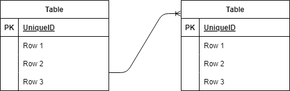

## アプリケーション名
確認テスト：お問合せフォーム

##　環境構築
・リポジトリの設定　　
コマンドラインにて　　
git clone git clone git@github.com:yuusukejinba/jinba-tuiki.git  

・Docker の設定  
1.docker-compose up -d --build  
2.docker-compose exec php bash:PHPコンテナ内にログイン  
3.composer install:コンポーズインストール  

・.env ファイルの作成  
1.cp .env.example .env: .env.exampleファイルをコピー  
2.DB_HOST=127.0.0.1→DB_HOST=mysql  
3.DB_DATABASE=→DB_DATABASE=laravel_db  
4.DB_USERNAME=→DB_USERNAME=laravel_user  
5.DB_PASSWORD=→DB_PASSWORD=laravel_passに変更  

## ER図
